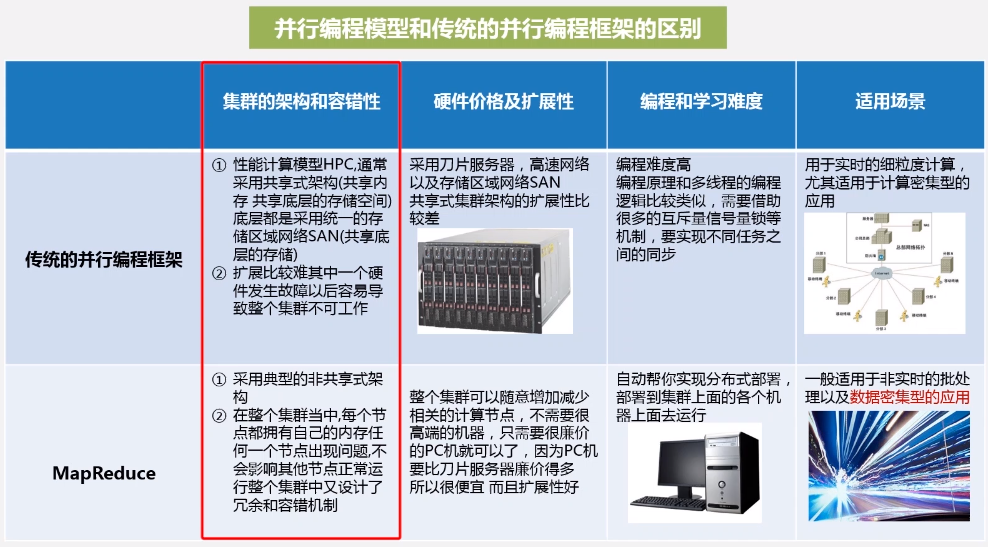

# 大数据技术原理与应用

## 概述

* 第三次信息浪潮：物联网 大数据 云计算
* 技术支撑：存储 计算 通信
* 科学研究范式：实验-->理论-->计算-->数据
* 大数据特性：大量化 快速化 多样化 价值密度低
* 大数据思维方式：全样而非抽样，效率而非精确，相关而非因果
* 大数据应用：影视剧的拍摄，谷歌预测流感...
* 大数据技术层次：数据采集 数据存储与管理 数据处理与分析 数据隐私与安全
* 大数据计算模式：
  * 批处理计算：针对大规模数据的批量处理（MapReduce、Spark...）
  * 流计算：针对流数据的实时运算（S4、Storm、Flume、Streams、Puma、Super Mario...）
  * 图计算：针对大规模图结构数据的处理（Google Pregel、GraphX、Giraph...）
  * 查询分析计算：大规模数据的存储管理和查询分析（Google Dremel、Hive、Cassandra...）
* 云计算模式：公有云、私有云、混合云
* 云计算服务：基础设施即服务(IaaS)、平台即服务(PaaS)、软件即服务(SaaS)
* 云计算关键技术：虚拟化、分布式存储、分布式计算、多租户
* 物联网层次架构：感知层、网络层、处理层、应用层

## Hadoop

HDFS+MapReduce

### HDFS

### MapReduce

* 分布式并行编程

* 1000个worker，同时运行GFS+MapReduce，把大文件传进GFS拆分，master找到input1的workers、input2的workers...让他们进行Map(k, v)，得到处理好的分布式的map，一个Reduce(key, value-list) 通过网络找到所有worker处理好的所有map的一个key进行处理，输出(k, v)

* shuffle(Map)
  * 输入数据执行Map任务
  * 写入缓存
  * 溢写（分区、排序、合并）-->设置溢写比例
  * 文件柜并
* shuffle(Reduce)
  * 领取数据
  * 归并数据
  * 把数据输入给Reduce