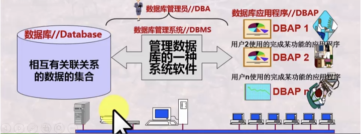
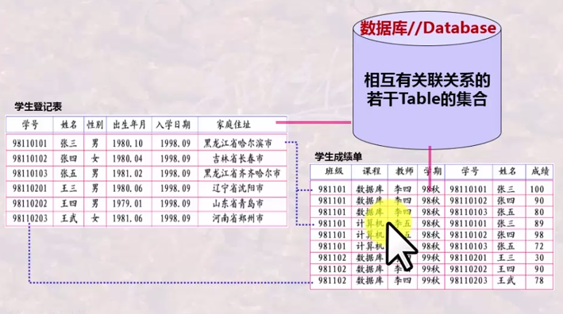
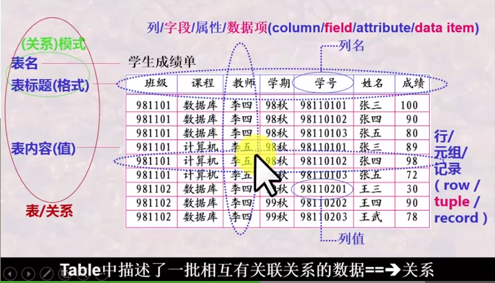

# 数据库系统

## 一. 数据库基本知识与关系模型

### (一). 数据库系统基本概念

#### 数据库系统组成

1. 数据库（DB）

2. 数据库管理系统（DBMS）
   * 数据库语言：DDL、DML、DCL统称为SQL语言，是结构化的数据库语言，可以嵌入到高级语言中
     * 数据库定义：DBMS提供一套数据定义语言（DDL）给用户，定义数据库中Table的名称、标题（内含的属性名称及对该属性的值的要求）
     * 数据库操纵：DBMS提供一套数据操纵语言（DML）给用户，向数据库Table中增加、删除、更新数据及对数据进行查询、检索、统计...
     * 数据库控制：DBMS提供一套数据控制语言（DCL）给用户，控制数据库中数据的使用（哪些用户可以，哪些用户不可以)
   * 系统程序集合：存储与索引、查询优化、事务处理、编译执行控制、通讯处理、各种控制程序
3. 数据库应用（DBAP）
4. 数据库管理员（DBA）
5. 计算机基本系统

#### 数据库系统结构抽象与演变

* 视图/数据：某一种表现形式下表现出来的数据库中的数据
* 模式：对数据库中的数据所进行的一种结构性的描述，即数据的结构信息
* 数据模型：模式的结构信息，包括：数据结构、操作、约束
* 三级视图（三级模式）：
  * 外部视图（外部模式）：某一用户能看到与处理的数据（的结构描述）
  * 概念视图（概念模式）：从全局角度理解、管理的数据（的结构描述），体现数据之间的内在本质联系
  * 内部视图（内部模式）：存储在介质上的数据（的结构描述），含存储路径、存储方式、索引方式...
* 两层映像：
  * E-C Mapping：将外部模式映射为概念模式，便于用户观察使用
  * C-I Mapping：将概念模式映射为内部模式，便于计算机存储和处理
* 两个独立性：
  * 逻辑数据独立性：当概念模式发生变化时，只需改变E-C Mapping，即可以不改变外部模式
  * 物理数据独立性：当内部模式发生变化时，只需改变C-I Mapping，即可以不改变概念模式，从而不改变外部模式

### (二). 关系模型与关系运算

####

####

####

## 二. 数据库语言

### (一). 交互式SQL语言及其应用

####

####

####

### (二). 数据库应用程序开发

####

####

## 三. 数据建模与数据库设计

### (一). 数据建模与数据库设计

### (二). 数据库设计理论

## 四. 数据库管理系统实现技术

### (一). 数据库存储与索引技术

### (二). 数据库基本操作实现算法

### (三). 数据库查询优化与查询实现

### (四). 数据库事务管理
