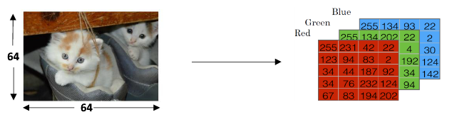
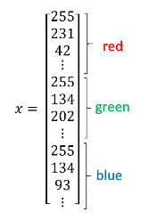
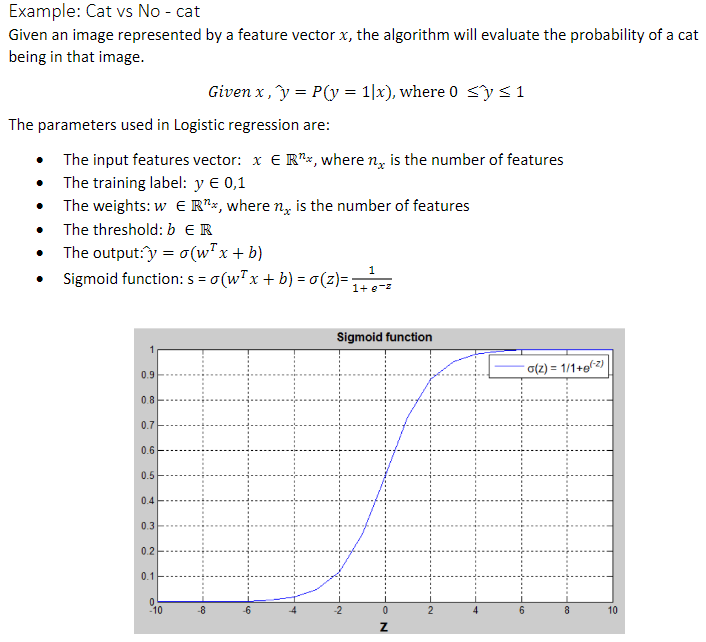
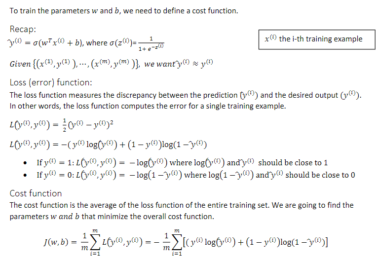
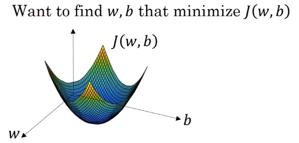

# Deep Learning

## Neural Network

### 1. Summary

Supervised Learning

* Standard Neural Net
  * Read Estate : Home features...Price
  * Online Advertising : Ad,uer info...Click on ad?

* Convolutional Neural Network
  * Photo tagging : Image...Object(1,...,1000)
* Recurrent NN
  * Speech recognition : Audio...Text transcript
  * Machine translation : English...Chinese

* Hybrid NN
  * Autonomous driving : Image,Radar info...Position of other cars

Structured Data : databases of data

Unstructured Data : audio,raw audio,images,text

Scale drives deep learning progress

* Data
* Computation
* Algorithms : sigmod...rectified linear unit (ReLU)

### 2. Basic

#### Notation

​	

​	∈Rnx

​	y∈{0,1}

​	n=nx=64\*64\*3

​	(x,y)...a single training example

​	m=mtrain...number of training examples

​	mtest...number of test examples

​	{(x(1),y(1)),(x(2),y(2)),...,(x(m),y(m))}...training set

​	X=[x(1),x(2),...,x(m)]...Rnx*m matrix

​	Y=[y(1),y(2),...,y(m)]...R1*m matrix

#### logistic regression

#### Gradient Descent

* w := w-α