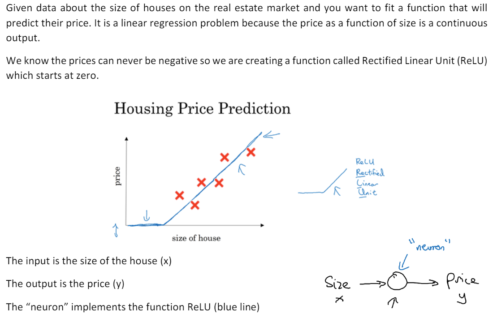
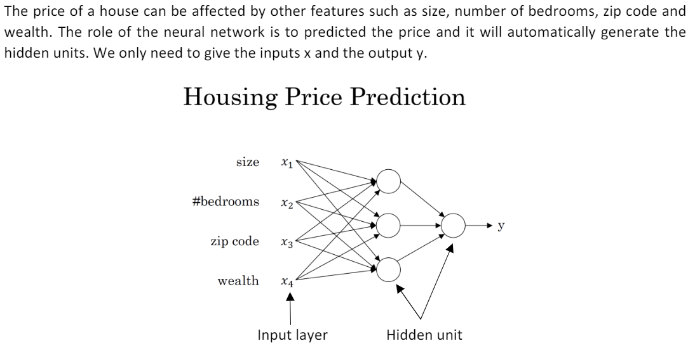
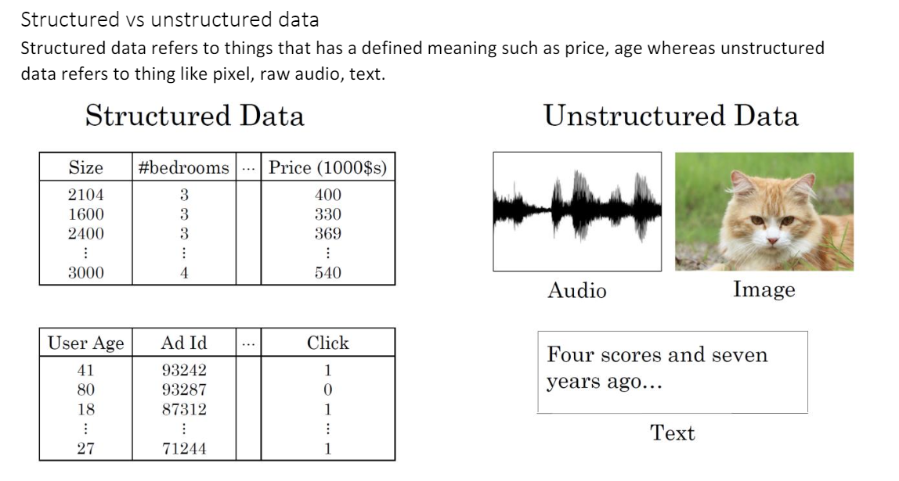
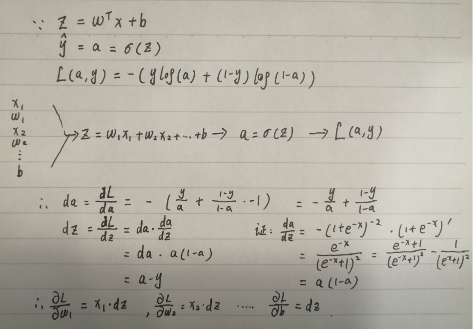
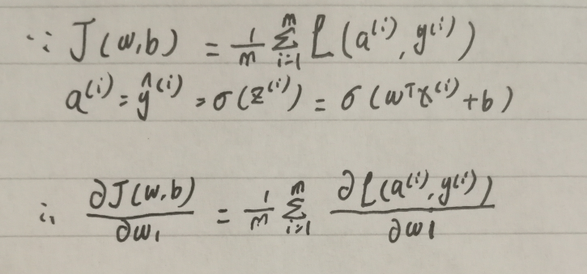
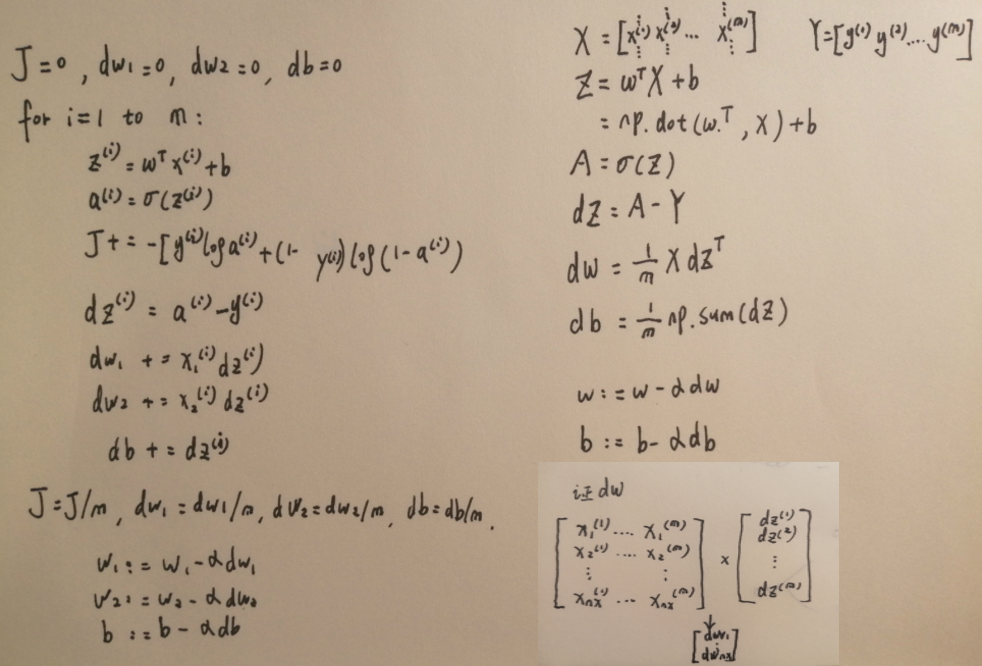

# Deep Learning

## Neural Network

### 1. 深度学习概论

* 神经网络引入：
  * Single neural network

    

  * Multiple neural network

    

* 神经网络的监督学习：

  * Standard Neural Net
    * 房地产：Home features...Price
    * 在线广告：Ad,uer info...Click on ad?

  * Convolutional Neural Network
    * 图像识别：Image...Object(1,...,1000)
  * Recurrent NN
    * 语音识别
    * 机器翻译

  * Hybrid NN
    * 自动驾驶：Image,Radar info...Position of other cars

* 数据类型：

  

* 规模推动深度学习发展
  * 数据量
  * 计算力
  * 算法：sigmod...rectified linear unit (ReLU)

### 2. 神经网络基础

#### 二分类

* 例子

  有一张图片作为输入，如果识别是只猫则输出标签1，如果识别不是猫则输出标签0。为保存一张图片，需要保存三个矩阵，它们分别对应图片中的红、绿、蓝三种颜色通道，如果你的图片大小为64x64像素，那么你就有三个规模为64x64的矩阵，分别对应图片中红、绿、蓝三种像素的强度值。为了便于表示，这里我画了三个很小的矩阵，注意它们的规模为5x4 而不是64x64，如下图所示：

​	

* 符号约定

  图片的特征向量：∈R<sup>n<sub>x</sub></sup>

  特征向量维度：n=n<sub>x</sub>=64\*64\*3

  输出结果：$y$ 取值为 $(0,1)$

  一个单独的样本：(x,y)

  训练集：{(x<sup>(1)</sup>,y<sup>(1)</sup>),(x<sup>(2)</sup>,y<sup>(2)</sup>),...,(x<sup>(m)</sup>,y<sup>(m)</sup>)}

  训练集样本数：m=m<sub>train</sub>

  测试集样本数：m<sub>test</sub>

  训练集输入值：X = [x<sup>(1)</sup>,x<sup>(2)</sup>,...,x<sup>(m)</sup>]，X.shape = (n<sub>x</sub>, m)

  训练集输出值：Y = [y<sup>(1)</sup>,y<sup>(2)</sup>,...,y<sub>(m)</sub>]，Y.shape = (1, m)

#### 逻辑回归

* 简介

  逻辑回归是监督学习的一种算法，适用于二分类问题（输出结果要么为0要么为1），目标是最小化训练数据与预测值的误差

* 公式

  $\hat{y}=\sigma(w^{\mathrm{T}}x+b)$

* 符号约定

  $\hat{y}$：预测值

  $\sigma$：sigmod函数，公式为 $\sigma \left( z \right)=\frac{1}{1+{{e}^{-z}}}$

  w：参数，表示特征权重

  b：参数，表示偏差

* 关于**sigmoid**函数的公式是这样的，$\sigma \left( z \right)=\frac{1}{1+{{e}^{-z}}}$,在这里$z$是一个实数，这里要说明一些要注意的事情，如果$z$非常大，那么${{e}^{-z}}$将会接近于0，所以关于$z$的**sigmoid**函数会接近于1。相反地，如果$z$非常小或者说是一个绝对值很大的负数，那么关于${{e}^{-z}}$这项会变成一个很大的数，所以这个关于$z$的**sigmoid**函数会接近于0。因此当你实现逻辑回归时，你的工作就是去让机器学习参数$w$以及$b$这样才使得$\hat{y}$成为对$y=1$这一情况的概率的一个很好的估计。

#### 逻辑回归的代价函数

**为什么需要代价函数：**

为了训练逻辑回归模型的参数参数$w$和参数$b$我们，需要一个代价函数，通过训练代价函数来得到参数$w$和参数$b$。先看一下逻辑回归的输出函数：

[](https://github.com/fengdu78/deeplearning_ai_books/blob/master/images/4c9a27b071ce9162dbbcdad3393061d2.png)

为了让模型通过学习调整参数，你需要给予一个$m$样本的训练集，这会让你在训练集上找到参数$w$和参数$b$,，来得到你的输出。

对训练集的预测值，我们将它写成$\hat{y}$，我们更希望它会接近于训练集中的$y$值，需要说明上面的定义是对一个训练样本来说的，训练样本$i$所对应的预测值是${{y}^{(i)}}$,是用训练样本的${{w}^{T}}{{x}^{(i)}}+b$然后通过**sigmoid**函数来得到，也可以把$z$定义为${{z}^{(i)}}={{w}^{T}}{{x}^{(i)}}+b$,我们将使用这个符号$(i)$注解，上标$(i)$来指明数据表示$x$或者$y$或者$z$或者其他数据的第$i$个训练样本，这就是上标$(i)$的含义。

**损失函数：**

损失函数又叫做误差函数，用来衡量算法的运行情况，**Loss function:$L\left( \hat{y},y \right)$.**

我们通过这个$L$称为的损失函数，来衡量预测输出值和实际值有多接近。一般我们用预测值和实际值的平方差或者它们平方差的一半，但是通常在逻辑回归中我们不这么做，因为当我们在学习逻辑回归参数的时候，会发现我们的优化目标不是凸优化，只能找到多个局部最优值，梯度下降法很可能找不到全局最优值，虽然平方差是一个不错的损失函数，但是我们在逻辑回归模型中会定义另外一个损失函数。

我们在逻辑回归中用到的损失函数是：$L\left( \hat{y},y \right)=-y\log(\hat{y})-(1-y)\log (1-\hat{y})$

为什么要用这个函数作为逻辑损失函数？当我们使用平方误差作为损失函数的时候，你会想要让这个误差尽可能地小，对于这个逻辑回归损失函数，我们也想让它尽可能地小，为了更好地理解这个损失函数怎么起作用，我们举两个例子：

当$y=1$时损失函数$L=-\log (\hat{y})$，如果想要损失函数$L$尽可能得小，那么$\hat{y}$就要尽可能大，因为**sigmoid**函数取值$[0,1]$，所以$\hat{y}$会无限接近于1。

当$y=0$时损失函数$L=-\log (1-\hat{y})$，如果想要损失函数$L$尽可能得小，那么$\hat{y}$就要尽可能小，因为**sigmoid**函数取值$[0,1]$，所以$\hat{y}$会无限接近于0。

在这门课中有很多的函数效果和现在这个类似，就是如果$y$等于1，我们就尽可能让$\hat{y}$变大，如果$y$等于0，我们就尽可能让 $\hat{y}$ 变小。

**代价函数**

损失函数是在单个训练样本中定义的，它衡量的是算法在单个训练样本中表现如何，为了衡量算法在全部训练样本上的表现如何，我们需要定义一个算法的代价函数：对$m$个样本的损失函数求和然后除以$m$: $J\left( w,b \right)=\frac{1}{m}\sum\limits_{i=1}^{m}{L\left( {{{\hat{y}}}^{(i)}},{{y}^{(i)}} \right)}=\frac{1}{m}\sum\limits_{i=1}^{m}{\left( -{{y}^{(i)}}\log {{{\hat{y}}}^{(i)}}-(1-{{y}^{(i)}})\log (1-{{{\hat{y}}}^{(i)}}) \right)}$ 

损失函数只适用于像这样的单个训练样本，而代价函数是参数的总代价，所以在训练逻辑回归模型时候，我们需要找到合适的$w$和$b$，来让代价函数 $J$ 的总代价降到最低。根据我们对逻辑回归算法的推导及对单个样本的损失函数的推导和针对算法所选用参数的总代价函数的推导，结果表明逻辑回归可以看做是一个非常小的神经网络。

#### 梯度下降法

**梯度下降法可以做什么？**

在你测试集上，通过最小化代价函数$J(w,b)$ 来训练的参数$w$和$b$


**梯度下降法的形象化说明**

在这个图中，横轴表示你的空间参数$w$和$b$，在实践中，$w$可以是更高的维度，但是为了更好地绘图，我们定义$w$和$b$，都是单一实数，代价函数（成本函数）$J(w,b)$是在水平轴$w$和$b$上的曲面，因此曲面的高度就是$J(w,b)$在某一点的函数值。我们所做的就是找到使得代价函数（成本函数）$J(w,b)$函数值是最小值，对应的参数$w$和$b$。

如图，代价函数（成本函数）$J(w,b)$是一个凸函数(**convex function**)，像一个大碗一样。

[](https://github.com/fengdu78/deeplearning_ai_books/blob/master/images/236774be30d12524a2002c3c484d22d5.jpg)

如图，这就与刚才的图有些相反，因为它是非凸的并且有很多不同的局部最小值。由于逻辑回归的代价函数（成本函数）$J(w,b)$特性，我们必须定义代价函数（成本函数）$J(w,b)$为凸函数。

[](https://github.com/fengdu78/deeplearning_ai_books/blob/master/images/af11ecd5d72c85f777592f8660678ce6.jpg)

*1. 初始化 $w$和 $b$*

可以用如图那个小红点来初始化参数$w$和$b$，也可以采用随机初始化的方法，对于逻辑回归几乎所有的初始化方法都有效，因为函数是凸函数，无论在哪里初始化，应该达到同一点或大致相同的点。我们以如图的小红点的坐标来初始化参数$w$和$b$。

[](https://github.com/fengdu78/deeplearning_ai_books/blob/master/images/0ad6c298d0ac25ca9b26546bb06d462c.jpg)

*2. 朝最陡的下坡方向走一步，不断地迭代*

我们朝最陡的下坡方向走一步，走到了如图中第二个小红点处，我们可能停在这里也有可能继续朝最陡的下坡方向再走一步，经过两次迭代走到第三个小红点处。


[](https://github.com/fengdu78/deeplearning_ai_books/blob/master/images/c5eda5608fd2f4d846559ed8e89ed33c.jpg)

*3.直到走到全局最优解或者接近全局最优解的地方*

通过以上的三个步骤我们可以找到全局最优解，也就是代价函数（成本函数）$J(w,b)$这个凸函数的最小值点。

**梯度下降法的细节化说明（仅有一个参数）**

[](https://github.com/fengdu78/deeplearning_ai_books/blob/master/images/5300d40870ec58cb0b8162747b9559b9.jpg)

假定代价函数$J(w)$ 只有一个参数$w$，即用一维曲线代替多维曲线，这样可以更好画出图像。

迭代就是不断重复做如图的公式 [](https://github.com/fengdu78/deeplearning_ai_books/blob/master/images/60cc674531ac72b2d75b0c447db95e96.jpg)

$a $ 表示学习率（**learning rate**），用来控制步长（**step**），即向下走一步的长度$\frac{dJ(w)}{dw}$ 就是函数$J(w)$对$w$ 求导（**derivative**），在代码中我们会使用$dw$表示这个结果。

假设我们以如图点为初始化点，该点处的斜率的符号是正的，即$\frac{dJ(w)}{dw}>0$，所以接下来会向左走一步。

[](https://github.com/fengdu78/deeplearning_ai_books/blob/master/images/27be50001e7a91bd2abaaeaf7aba7cd4.jpg)

整个梯度下降法的迭代过程就是不断地向左走，直至逼近最小值点。

[](https://github.com/fengdu78/deeplearning_ai_books/blob/master/images/4fb3b91114ecb2cd81ec9f3662434d81.jpg)

假设我们以如图点为初始化点，该点处的斜率的符号是负的，即$\frac{dJ(w)}{dw}<0$，所以接下来会向右走一步。

[](https://github.com/fengdu78/deeplearning_ai_books/blob/master/images/579fb3957063480420c6a7d294503e97.jpg)

整个梯度下降法的迭代过程就是不断地向右走，即朝着最小值点方向走。

[](https://github.com/fengdu78/deeplearning_ai_books/blob/master/images/21541fc771ad8895c18d292dd4734fe7.jpg)

**梯度下降法的细节化说明（两个参数）**

逻辑回归的代价函数（成本函数）$J(w,b)$是含有两个参数的。

[](https://github.com/fengdu78/deeplearning_ai_books/blob/master/images/593eb7e2835b4f3c3aa8185cfa76155c.png) 

$\frac{\partial J(w,b)}{\partial w}$ 就是函数$J(w,b)$ 对$w$ 求偏导，在代码中我们会使用$dw$ 表示这个结果； $\frac{\partial J(w,b)}{\partial b}$ 就是函数$J(w,b)$对$b$ 求偏导，在代码中我们会使用$db$ 表示这个结果。

#### 逻辑回归中的梯度下降法

**对参数求偏导**

*单个训练样本（损失函数求偏导）*



*m个训练样本（代价函数求偏导）*



**逻辑回归的梯度下降的一次迭代**

```python
J=0;dw1=0;dw2=0;db=0;
for i = 1 to m
    z(i) = wx(i)+b;
    a(i) = sigmoid(z(i));
    J += -[y(i)log(a(i))+(1-y(i))log(1-a(i));
    dz(i) = a(i)-y(i);
    dw1 += x1(i)dz(i);
    dw2 += x2(i)dz(i);
    db += dz(i);
J/= m;
dw1/= m;
dw2/= m;
db/= m;
w=w-alpha*dw
b=b-alpha*db
```

#### 向量化

上述代码计算中有两个缺点，也就是说应用此方法在逻辑回归上你需要编写两个**for**循环。第一个**for**循环是一个小循环遍历$m$个训练样本，第二个**for**循环是一个遍历所有特征的**for**循环。这个例子中我们只有2个特征，所以$n$等于2并且${{n}_{x}}$ 等于2。 但如果你有更多特征，你开始编写你的因此$d{{w}_{1}}$，$d{{w}_{2}}$，你有相似的计算从$d{{w}_{3}}$一直下去到$d{{w}_{n}}$。所以看来你需要另一个**for**循环遍历所有$n$个特征。代码中显式地使用**for**循环使你的算法很低效,所以这里有一些叫做向量化技术,它可以允许你的代码摆脱这些显式的**for**循环。

```python
import numpy as np
import time

#随机两个100万维的数组
a=np.random.rand(1000000)
b=np.random.rand(1000000)

#向量化的版本
tic=time.perf_counter()
c=np.dot(a,b)
toc=time.perf_counter()
print(c)
print("Vectorized version:"+str(1000*(toc-tic))+"ms")	#向量化:≈0.6ms

#非向量化的版本
c=0
tic=time.perf_counter()
for i in range(1000000):
    c+=a[i]*b[i]
toc=time.perf_counter()
print(c)
print("For loop:"+str(1000*(toc-tic))+"ms")				#for循环:≈600ms
```

让我们看另外一个例子。如果你想计算向量$u=Av$，这时矩阵乘法定义为，矩阵乘法的定义就是：$u_{i} =\sum_{j}^{}{A_{\text{ij}}v_{i}}$，这取决于你怎么定义$u_{i}$值。同样使用非向量化实现，$u=np.zeros(n,1)$， 并且通过两层循环$for(i):for(j):$，得到$u[i]=u[i]+A[i][j]*v[j]$ 。现在就有了$i$ 和 $j$ 的两层循环，这就是非向量化。向量化方式就可以用$u=np.dot(A,v)$，右边这种向量化实现方式，消除了两层循环使得代码运行速度更快。

下面通过另一个例子继续了解向量化。如果你已经有一个向量$v$，并且想要对向量$v$的每个元素做指数操作，得到向量$u$等于$e$的$v_1$，$e$的$v_2$，一直到$e$的$v_n$次方。这里是非向量化的实现方式，首先你初始化了向量$u=np.zeros(n,1)$，并且通过循环依次计算每个元素。但事实证明可以通过**python**的**numpy**内置函数，帮助你计算这样的单个函数。所以我会引入`import numpy as np`，执行 $u=np.exp(v)$ 命令。注意到，在之前有循环的代码中，这里仅用了一行代码，向量$v$作为输入，$u$作为输出。你已经知道为什么需要循环，并且通过右边代码实现，效率会明显的快于循环方式。

* 常用numpy库函数
  * 计算各元素指数值：`np.exp(v)`
  * 计算各元素对数值：`np.log10(v)`
  * 计算各元素绝对值：`np.abs(v)`
  * 比较最大值：`np.maximum(v,0)`
  * 返回最大的元素：`np.max(v)`

#### Vectorizing Logistic Regression's Gradient Computation



#### Broadcasting

Matrix(m,n) 加减乘除 Matrix(m,1) or Matrix(1,n)...后者复制 n or m 次，再运算

Matrix(1,n) or Matrix(m,1) 加减乘除 实数...后者复制 m or n 次，再运算

```python
import numpy as np
A=np.array([[56.0,0.0,4.4,68.0],
           [1.2,104.0,52.0,8.0],
           [1.8,135.0,99.0,0.9]])
cal=A.sum(axis=0)						#A竖直求和，如需水平求和令axis=1
percentage=100*A/cal.reshape(1,4)		#.reshape(1,4)可忽略，但无需吝啬使用
```

```python
import numpy as np
a=np.random.randn(5)					#a.shape=(5,)...rank 1 array
a=np.random.randn(5,1)					#a.shape=(5,1)...Matrix(column vector)
a=np.random.randn(1,5)					#a.shape=(1,5)...Matrix(row vector)
assert(a.shape==(5,1))					#确保Matrix形状，无需吝啬使用
```

### 3. 浅层神经网络

### 4. 深层神经网络
