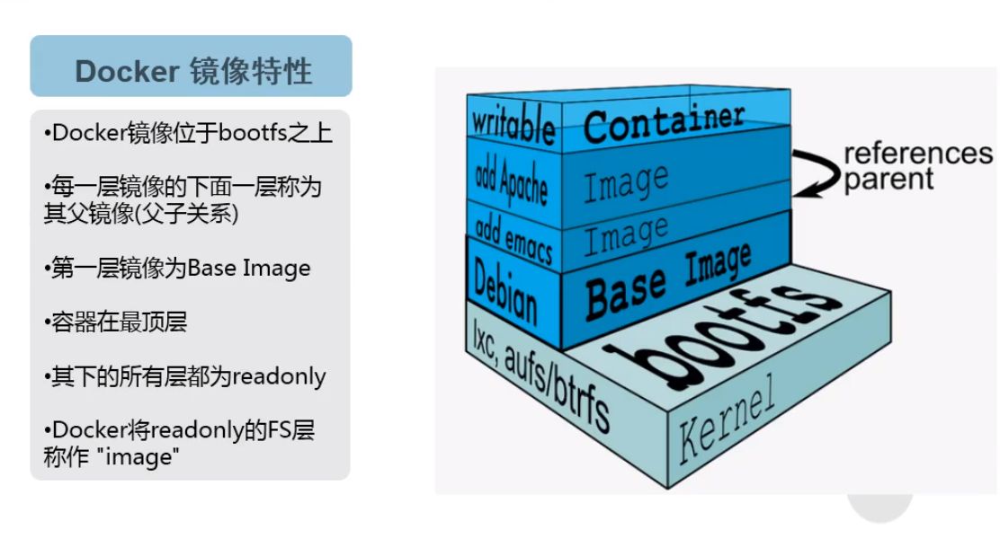

# Docker

## Docker安装


```shell
#卸载旧版本
sudo yum remove docker \
                  docker-client \
                  docker-client-latest \
                  docker-common \
                  docker-latest \
                  docker-latest-logrotate \
                  docker-logrotate \
                  docker-engine
#安装所需软件包
sudo yum install -y yum-utils
#设置稳定存储库
sudo yum-config-manager \
    --add-repo \
    https://download.docker.com/linux/centos/docker-ce.repo
    https://mirrors.aliyun.com/docker-ce/linux/centos/docker-ce.repo(任选其一)
#安装
sudo yum install docker-ce docker-ce-cli containerd.io
#验证
sudo systemctl start docker								#启动docker
systemctl enable docker									#开机自启
sudo docker run hello-world								#启动hello-world容器
#卸载
sudo yum remove docker-ce docker-ce-cli containerd.io
sudo rm -rf /var/lib/docker
#配置镜像加速
vim /etc/docker/daemon.json

{
"registry-mirrors": [
  "https://mirror.ccs.tencentyun.com"
]
}

sudo systemctl daemon-reload
sudo systemctl restart docker
```

## Docker入门



### 常用命令

```shell
#查看docker版本系统信息
docker version
docker info
#登录dockerhub
docker login docker.io
#查看docker密码
cat /root/.docker/config.json
echo "amlodWF5aTpNSU1BamlhbmRhbjUyMQ=="|base64 -d
#获取命令帮助信息
docker --help
docker 命令 --help
#查看镜像和容器的详细信息(镜像和容器可用名字的地方也可用id)
docker inspect centos:latest
docker inspect cenos1
```

### 镜像命令

镜像的结构：registry_name/repository_name/image_name:tag_name

一个镜像可以打很多tag，看起来是很多镜像，其实是一个镜像多个tag，当tag删光，镜像也会自动删除

```shell
#缺省自动按顺序补充为:docker.io/library
docker images												#查看本地镜像
docker search mysql											#搜索镜像
docker pull mysql											#下载镜像，默认latest标签
docker pull centos:latest									#下载指定tag的镜像
docker tag mysql:latest jihuayi/mysql:test					#添加标签
docker rmi -f mysql:latest									#删除指定标签，若为单一标签，则删除镜像
docker rmi -f jihuayi/mysql:test							#删除指定标签，若为单一标签，则删除镜像
docker rmi -f a347a5928046									#删除指定镜像
docker rmi -f $(docker images -aq)							#删除全部镜像
docker push jihuayi/mysql:test								#推送镜像
docker save mysql:latest > mysql-latest.tar					#导出指定镜像为tar包
docker load < mysql-latest.tar								#用tar包导入镜像
```

### 容器命令

对于容器而言，其启动程序就是容器应用进程，容器就是为了主进程而存在的，主进程退出，容器就失去了存在的意义，从而退出，其它辅助进程不是它需要关心的东西。

例如 `service nginx start` 命令，会被理解为 `CMD [ "sh", "-c", "service nginx start"]`，因此主进程实际上是 `sh`。那么当 `service nginx start` 命令结束后，`sh` 也就结束了，`sh` 作为主进程退出了，自然就会令容器退出。

正确的做法是直接执行 `nginx` 可执行文件，并且要求以前台形式运行：``CMD ["nginx", "-g", "daemon off;"]``

```shell
#查看本地容器进程(-a 所有，包括已退出)
docker ps -a
docker container ls -a
docker ps -a|grep hello			#只看含关键字hello的进程
#启动交互式容器(-i 可交互;-t 关联输入输出;--rm 退出后即删除容器;--name xxx 定义容器名称)
docker run -it --name centos1 centos:latest bash
#启动后台容器(-d 后台方式运行;)
docker run -d --name centos2 centos:latest /bin/sleep 300
#容器端口映射(-p 本地端口:容器端口)
docker run -d --name nginx1 -p 81:80 nginx:latest
#挂载数据卷(-v 本地目录/不存在的数据卷名字:容器目录)
#(前者将本地目录覆盖式挂载至容器目录，后者则自动在/var/lib/docker/volumes创建数据卷并将容器目录内容移动至数据卷的_data目录再挂载)
mkdir html
cd html
wget www.baidu.com -O index.html
docker run -d --name nginx2 -p 82:80 -v /root/html:/usr/share/nginx/html nginx:latest
docker run -d --name nginx3 -p 83:80 -v aa:/usr/share/nginx/html nginx:latest
#传递环境变量(-e 环境变量key=环境变量value)
docker run --rm -e E_OPTS=abc -e C_OPTS=123 nginx:latest printenv
#宿主机与容器复制文件(源->目的)
docker cp /root/tshock centos1:/root/tshock
docker cp centos1:/root/tshock /root/tshock
#在宿主机查看进程
ps aux|grep sleep|grep -v grep
#进入指定后台容器
docker exec -it centos2 bash
#启动/停止/重启指定容器
docker start/stop/restart centos1
#删除指定容器(-f 可强制删除在运行的)
docker rm centos2
#删除exit的容器
for i in `docker ps -a|grep -i exit|awk '{print $1}'`;do docker rm $i;done
#删除所有容器
docker rm -f $(docker ps -aq)
#查看容器日志(-f 动态跟踪实时日志; -t 加时间戳)
docker logs nginx1
#容器内安装工具包(若不存在,一般用yum/apt-get/apt来安装)
docker exec -it nginx2 bash
curl
tee /etc/apt/sources.list << EOF
deb http:mirrors.163.com/debian/ jessie main non-free contrib
deb http:mirrors.163.com/debian/ jessie-updates main non-free contrib
EOF
apt-get update && apt-get install curl
```

## Docker镜像制作

### 容器提交

```shell
#用指定容器做成新镜像的例子
docker run -it --name centos1 centos:latest bash								#运行一个容器centos1
echo hello > 1.txt																#在容器centos1内建立1.txt
docker commit -p centos1 jihuayi/centos:latest_with_1.txt						#用centos1做成新镜像
docker run -it --rm --name centos2 jihuayi/centos:latest_with_1.txt bash		#此时新容器centos2建立则自带1.txt
```

### 利用Dockerfile

```shell
#Dockerfile预备工作
mkdir /data/dockerfile
cd /data/dockerfile
cp /root/html/index.html .
vi docker-entrypoint.sh													#entrypoint脚本编辑

#!/bin/bash
/sbin/nginx -g "daemon off;"

chmod +x docker-entrypoint.sh
vi /data/dockerfile/Dockerfile											#Dockerfile的编辑(指令大写，内容小写)

#USER/WORKDIR
FROM docker.io/library/nginx:latest
USER nginx																#whoami
WORKDIR /usr/share/nginx/html											#pwd
#ADD/EXPOSE
FROM docker.io/library/nginx:latest
ADD index.html /usr/share/nginx/html/index.html							#把指定文件固定到镜像
EXPOSE 80																#监听的端口，配合docker run -P使用
#RUN/ENV
FROM docker.io/library/centos:7
ENV VER 9.11.4															#环境变量固定到镜像
RUN yum install bind-$VER -y											#在镜像里执行命令
#CMD(docker run时默认执行的命令，会被docker run镜像名后的command替换)
FROM centos:7
RUN yum install httpd -y
CMD ["httpd","-D","FOREGROUND"]
#ENTRYPOINT(docker run时默认执行的命令(脚本)，CMD内容会作为参数传给ENTRYPOINT)
FROM centos:7
ADD docker-entrypoint.sh /docker-entrypoint.sh
RUN yum install epel-release -q -y && yum install nginx -y
ENTRYPOINT ["docker-entrypoint.sh"]

#用Dockerfile创建镜像
docker build -t jihuayi/xxx_with_xxx
```

小例子：

```shell
vi /data/dockerfile/demo.jhy.com.conf

server{
	listen 80;
	server_name demo.jhy.com;
	
	root /usr/share/nginx/html;
}

vi /data/dockerfile/Dockerfile

FROM nginx:latest
USER root
ENV WWW /usr/share/nginx/html
ENV CONF /etc/nginx/conf.d
RUN /bin/cp /usr/share/zoneinfo/Asia/Shanghai /etc/localtime &&\
	echo 'Asia/Shanghai' >/etc/timezone
WORKDIR $WWW
ADD index.html $WWW/index.html
ADD demo.jhy.com.conf $CONF/demo.jhy.com.conf
EXPOSE 80
CMD ["nginx","-g","daemon off;"]

docker build . -t jihuayi/nginx:baidu
docker run --rm -p80:80 jihuayi/nginx:baidu
```

## Docker的网络模型


