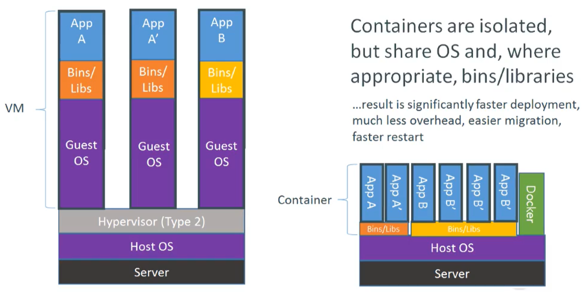

# Docker

## Docker安装



```shell
yum update										#升级包及系统内核
uname -a										#查看系统信息
cat /etc/redhat-release							#查看centos版本号
getenforce										#查看SElinux状态
systemctl is-enabled firewalld.service;echo $?	#查看防火墙是否开机自启
systemctl disable firewalld.service				#关闭防火墙开机自启
systemctl status firewalld.service				#查看防火墙状态
systemctl stop firewalld						#关闭防火墙
#卸载旧版本
sudo yum remove docker \
                  docker-client \
                  docker-client-latest \
                  docker-common \
                  docker-latest \
                  docker-latest-logrotate \
                  docker-logrotate \
                  docker-engine
#安装所需软件包
yum install -y yum-utils
#设置稳定存储库
yum-config-manager \
    --add-repo \
    https://mirrors.aliyun.com/docker-ce/linux/centos/docker-ce.repo
    https://download.docker.com/linux/centos/docker-ce.repo(任选其一)
yum makecache fast
#安装
yum install docker-ce docker-ce-cli containerd.io
#验证
systemctl enable docker							#开机自启
systemctl start docker							#启动docker
docker version									#查看docker版本
docker run hello-world							#启动hello-world容器
docker images									#查看本地镜像
docker image ls									#查看本地镜像
#卸载
yum remove docker-ce docker-ce-cli containerd.io
rm -rf /var/lib/docker
#配置镜像加速
vim /etc/docker/daemon.json

{
"registry-mirrors": [
  "https://mirror.ccs.tencentyun.com"
]
}

sudo systemctl daemon-reload
sudo systemctl restart docker
```

## Docker入门

### 常用命令

```shell
docker info												#查看docker系统信息
docker login docker.io									#登录dockerhub
cat /root/.docker/config.json
echo"amlodWF5aTpNSU1BamlhbmRhbjUyMQ=="|base64 -d
docker 命令 --help									   #获取命令帮助信息
```

### 镜像命令

镜像的结构：registry_name/repository_name/image_name:tag_name

```shell
docker search alpine										#搜索镜像
docker pull alpine											#下载镜像，默认latest
docker pull alpine:3.10.3									#下载指定tag的镜像
docker tag a24bb4013296 docker.io/jihuayi/alpine:oh			#添加标签
docker push docker.io/jihuayi/alpine:oh						#上传指定镜像到仓库
docker rmi docker.io/jihuayi/alpine:oh						#删除指定标签
docker rmi -f a24bb4013296									#删除指定镜像
docker rmi -f $(docker images -aq)							#删除全部镜像
docker save a4c0051da706 > alpine-latest_with_1.txt.tar		#导出镜像
docker load < alpine-latest_with_1.txt.tar					#导入镜像
```

### 容器初级命令

对于容器而言，其启动程序就是容器应用进程，容器就是为了主进程而存在的，主进程退出，容器就失去了存在的意义，从而退出，其它辅助进程不是它需要关心的东西。

例如 `service nginx start` 命令，会被理解为 `CMD [ "sh", "-c", "service nginx start"]`，因此主进程实际上是 `sh`。那么当 `service nginx start` 命令结束后，`sh` 也就结束了，`sh` 作为主进程退出了，自然就会令容器退出。

正确的做法是直接执行 `nginx` 可执行文件，并且要求以前台形式运行：``CMD ["nginx", "-g", "daemon off;"]``

```shell
#查看本地容器进程
docker ps -a
docker container ls
#启动交互式容器(-i 可交互;-t 关联输入输出;-d 后台方式运行;--rm 退出后即删除容器;--name="xx" 定义容器名称)
docker run -it --name="centos1" docker.io/library/centos:latest /bin/bash
#启动后台容器
docker run -d --name="centos2" docker.io/library/centos:latest /bin/sleep 300
#在宿主机查看进程
ps aux|grep sleep|grep -v grep
#进入指定后台容器
docker exec -it d7f1fab36c77 /bin/bash
#启动/停止/重启指定容器(容器id/容器名称)
docker start/stop/restart d7f1fab36c77
#删除指定容器(容器id/容器名称)
docker rm busy_chaum
#删除exit的容器
for i in `docker ps -a|grep -i exit|awk '{print $1}'`;do docker rm $i;done
#动态查看容器日志
docker run hello-world
docker ps -a|grep hello
docker logs -f b1aba187e92c
```

### 容器高级命令

```shell
#容器端口映射(-p 本地端口:容器端口)
docker pull nginx
docker run --rm --name="nginx1" -d -p81:80 docker.io/library/nginx:latest
#挂载数据卷(-v 本地目录:容器目录)
mkdir html
cd html
wget www.baidu.com -O index.html
docker run --rm --name="nginx2" -d -p82:80 -v/root/html:/usr/share/nginx/html nginx:latest
docker inspect nginx2
#传递环境变量(-e 环境变量key=环境变量value)
docker run --rm -e E_OPTS=abc -e C_OPTS=123 nginx:latest printenv
#容器内安装工具包(若不存在.yum/apt-get/apt)
docker exec -it nginx2 /bin/bash
curl
tee /etc/apt/sources.list << EOF
deb http:mirrors.163.com/debian/ jessie main non-free contrib
deb http:mirrors.163.com/debian/ jessie-updates main non-free contrib
EOF
apt-get update && apt-get install curl
```

## Docker镜像制作

### 容器提交

```shell
#修改并提交容器
docker run -it --name="alpine1" docker.io/library/alpine:latest /bin/sh
echo hello > 1.txt
docker commit -p alpine1 jihuayi/alpine:latest_with_1.txt
docker run -it --rm --name="alpine2" docker.io/jihuayi/alpine:latest_with_1.txt /bin/sh
```

### 利用Dockerfile

```shell
#Dockerfile预备工作
mkdir /data/dockerfile
cd /data/dockerfile
cp /root/html/index.html .
vi docker-entrypoint.sh													#entrypoint脚本编辑

#!/bin/bash
/sbin/nginx -g "daemon off;"

chmod +x docker-entrypoint.sh
vi /data/dockerfile/Dockerfile											#Dockerfile的编辑(指令大写，内容小写)

#USER/WORKDIR
FROM docker.io/library/nginx:latest
USER nginx																#whoami
WORKDIR /usr/share/nginx/html											#pwd
#ADD/EXPOSE
FROM docker.io/library/nginx:latest
ADD index.html /usr/share/nginx/html/index.html							#把指定文件固定到镜像
EXPOSE 80																#监听的端口，配合docker run -P使用
#RUN/ENV
FROM docker.io/library/centos:7
ENV VER 9.11.4															#环境变量固定到镜像
RUN yum install bind-$VER -y											#在镜像里执行命令
#CMD(docker run时默认执行的命令，会被docker run镜像名后的command替换)
FROM centos:7
RUN yum install httpd -y
CMD ["httpd","-D","FOREGROUND"]
#ENTRYPOINT(docker run时默认执行的命令(脚本)，CMD内容会作为参数传给ENTRYPOINT)
FROM centos:7
ADD docker-entrypoint.sh /docker-entrypoint.sh
RUN yum install epel-release -q -y && yum install nginx -y
ENTRYPOINT ["docker-entrypoint.sh"]

#用Dockerfile创建镜像
docker build -t jihuayi/xxx_with_xxx
```

小例子：

```shell
vi /data/dockerfile/demo.jhy.com.conf

server{
	listen 80;
	server_name demo.jhy.com;
	
	root /usr/share/nginx/html;
}

vi /data/dockerfile/Dockerfile

FROM nginx:latest
USER root
ENV WWW /usr/share/nginx/html
ENV CONF /etc/nginx/conf.d
RUN /bin/cp /usr/share/zoneinfo/Asia/Shanghai /etc/localtime &&\
	echo 'Asia/Shanghai' >/etc/timezone
WORKDIR $WWW
ADD index.html $WWW/index.html
ADD demo.jhy.com.conf $CONF/demo.jhy.com.conf
EXPOSE 80
CMD ["nginx","-g","daemon off;"]

docker build . -t jihuayi/nginx:baidu
docker run --rm -p80:80 jihuayi/nginx:baidu
```

## Docker的网络模型


