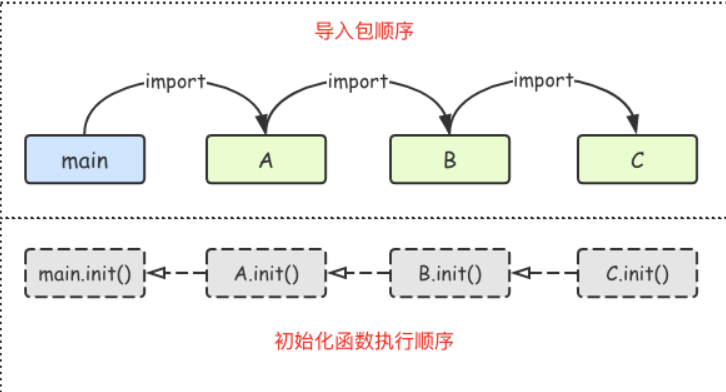

# Golang

## 引入

准备工作

```cmd
go version
go env -w GOPROXY=https://goproxy.cn,direct
```

创建hello项目

```cmd
mkdir hello
cd hello
go mod init hello
```

创建hello.go

```go
package main									// main包，表明当前是一个可执行程序

import "fmt"									// 导入内置fmt包

func main() {									// main函数，是程序执行的入口
    fmt.Println("Hello, World!")
}
```

编译hello项目

```cmd
// 1. win to win
go build
// 2. win to Linux
set GOOS=linux
set GOARCH=amd64
go build
// 3. win to mac
SET GOOS=darwin
SET GOARCH=amd64
go build
```

## 基础语法

```go
// "var name =" 在函数体内可与 "name :=" 等价替换
// 定义值类型（自动初始化）：int:0,  bool:false,  string:"",  数组按长度自动填充,  结构体内字段自动填充
// 定义指针类型（自动置为nil），用new定义（自动初始化）：即指向的内存自动填充
// 定义引用类型（自动置为nil），用make定义（自动初始化）：slice:按长度自动填充,  map:[]
```

### 变量

* 标准类型
  * 带符号整型：int8  int16  int32  int64  int(32位系统为int32，64位系统为int64)
  * 无符号整型：uint8  uint16  uint32  uint64  uint(32位系统为uint32，64位系统为uint64)
  * 浮点型：float32  float64  complex64（实部和虚部为32位）  complex128（实部和虚部为64位）
  * 布尔型：true  false（不能转为其他类型）
  * 指针型：uintptr
  * 字符串：string
* 自定义类型：`type ages int`  `type money float32`  `type months map[string]int`
* 类型别名：`rune`和`byte`就是类型别名，他们的定义如下：`type byte = uint8`  `type rune = int32`
* 定义：`var name type`（可批量，自动初始化）
* 定义并初始化：
  * `var name = value`
* 匿名变量：_，多用于占位，表示忽略值，不占用内存
* 格式控制符：%s: 字符串  %d: 十进制  %b: 二进制  %o: 八进制  %x: 十六进制  %T: 变量类型  %v: 相应值默认格式

### 常量

* 定义并初始化：`const pi = 3.1415`（可批量，如果省略值表示和上一行相同）
* 常量计数器：iota，遇const重置为0，const中每新增一行常量声明使iota计数一次

```go
func main() {
    const (
            a = 1000   					// 1000
        	b          					// 1000
        	c = iota   					// 2
        	d = "ha"   					// "ha"
        	e          					// "ha"
        	f = 100    					// 100
        	g          					// 100
        	h = iota   					// 7
        	i          					// 8
    )
    fmt.Println(a,b,c,d,e,f,g,h,i)		// 1000 1000 2 ha ha 100 100 7 8
}
```

### 字符串

* 多行字符串必须用反引号，反引号内转义字符无效，原样输出
* 不可以直接修改字符串内容，若需要修改先转成切片然后建立新字符串接收转换
* 字符：uint8--byte(ASCII)，int32--rune(UTF-8)
* 字符串：string（UTF-8。字符为ASCII上字符占1字节，其他字符2-4个字节）
* 字符串拼接：`s:=fmt.Sprintf(“%s%s”,name,word)`或`s:=name+word`
* 字符串分割：`s:=strings.Split(s1,” ”)`，返回字符串切片

```go
func main()  {
    // 统计字符串中单词出现次数
	ss:="how do you do"
	m:=make(map[string]int,10)
	s:=strings.Split(ss," ")
	s=append(s,"do")
    fmt.Println(s)					// [how do you do do]
	for _,v:=range s{
		m[v]++
	}
	fmt.Println(m)					// map[do:3 how:1 you:1]
}
```

* 判断字符串包含：`flag:=strings.Contains(s,”hello”)`
* 判断字符串前缀 ：`flag:=strings.HasPrefix(s,”hello”)`
* 判断字符串后缀：`flag:=strings.HasSuffix(s,”hello”)`
* 子串第一次出现的位置：`strings.Index(s,”hello”)`
* 字串最后一次出现的位置：`strings.LastIndex(s,”hello”)`
* 字符串切片拼接：`strings.Join(a[]string, sep string)`

* 判断字符是否为中文：`flag:=unicode.Is(unicode.Han)`

### 数组

* 定义：`var arr [3]int`（自动初始化）
* 定义并初始化：
  * `var arr = [...][2]int{{1,2},{3,4},{5,6}}`
* 数组长度必须是常量，长度是数组类型的一部分，大小不可修改
* Go语言支持多维数组，但多维数组只有最外层可以使用`...`来让编译器推导长度

```go
func main() {
	var a = [...]string{"北京", "上海", "深圳"}
	// 方法1：for循环遍历
	for i := 0; i < len(a); i++ {
		fmt.Println(a[i])
	}

	// 方法2：for range遍历
	for i, v := range a {
		fmt.Println(i, v)
	}
}
```

* 指针数组：[3]\*int，数组指针：\*[3]int
* 数组是值类型，支持 "=="、"!=" 操作符，赋值传参会复制整个数组，改变副本不影响本身

```go
func modifyArray(x [3][2]int) {
	x[2][0] = 100
}

func main() {
	a := [3][2]int{
		{1, 1},{1, 1},{1, 1},
	}
	modifyArray(a) 					// 在modify中修改的是a的副本x
	fmt.Println(a)  				// [[1 1] [1 1] [1 1]]
}
```

### 结构体

* 结构体占用一块连续的内存，空结构体不占用空间

* 声明

```go
type person struct {
	name, city string
	age        int8
}
```

* 定义：
  * `var p1 person`（自动初始化）
  * `var p1 = new(person)`（自动初始化）（虽然返回结构体指针，一般用`(*p1).name = "wang"`但也支持`p1.name = "wang"`的方式赋值）
* 定义并初始化：`P := person{age:24, name:"Tom"}`（若按顺序初始化所有字段时，则key可省略）
* 支持匿名字段，嵌套结构体（字段可以继承和重载，method可以继承和重写）

```go
type human struct {
	name  string
	age   int
	phone string	 	// human的phone字段
}

type student struct {
	human  				// 匿名字段human, 那么student继承了human所有字段及method
	school string
}

type employee struct {
	human  			 	// 匿名字段human, 那么employee继承了human所有字段及method
	company string
	phone   string 		// employee的phone字段, 同名字段最外层优先访问（重载）
}

// human的method
func (h *human) SayHi() {
	fmt.Printf("Hi, I am %s you can call me on %s\n", h.name, h.phone)
}

// employee的method（重写）
func (e *employee) SayHi() {
	fmt.Printf("Hi, I am %s, I work at %s. Call me on %s. My personal phone is:%s\n", e.name,
		e.company, e.phone, e.human.phone)
}

func main() {
	mark := student{human{"Mark", 25, "222-222-YYYY"}, "MIT"}
	Bob := employee{human{"Bob", 34, "777-444-XXXX"}, "Golang Inc", "333-222"}
	mark.SayHi()
	Bob.SayHi()
}
```
### 指针（指针类型）

* 定义：
  * `var name *type`（自动置为nil）
  * `var name = new(type)`（自动初始化）
* 定义并初始化：
  * `var name = &a`
* 不支持指针运算，取地址：'&'，指针取值：'*'
* new：一般用来给基本数据类型申请内存，返回对应类型指针
* make：只用于slice, map, chan的内存创建，返回这三个类型本身
* Go知道你要做的一切，会自动转换：
  * 如果一个method的receiver是\*T，可以在一个T类型的实例变量V上面调用这个method，而不需要&V去调用这个method
  * 如果一个method的receiver是T，可以在一个\*T类型的变量P上面调用这个method，而不需要\*P去调用这个method
### 切片 - 动态数组（引用类型）

* 定义：
  * `var name []type`（自动置为nil）
  * `var name = make([]type, len, cap)`（自动初始化）
* 定义并初始化：
  * `var name = []int{1,2,3,4}`
  * `var a = s[low:high]`（切片表达式，左闭右开，low缺省为0，high缺省为len(s)，支持基于数组构造切片，切片再切片）

```go
func main() {
    // 基于数组构造切片
	a := [5]int{1, 2, 3, 4, 5}
	s := a[1:3]															// high<=数组长度
	fmt.Printf("s:%v len(s):%v cap(s):%v\n", s, len(s), cap(s))			// s:[2 3] len(s):2 cap(s):4
    
    // 切片再切片
    s1 := s[:]
    s2 := s[0:4]														// high<=切片容量
    fmt.Printf("s1:%v len(s1):%v cap(s1):%v\n", s1, len(s1), cap(s1))	// s1:[2 3] len(s1):2 cap(s1):4
    fmt.Printf("s2:%v len(s2):%v cap(s2):%v\n", s2, len(s2), cap(s2))	// s2:[2 3 4 5] len(s2):4 cap(s2):4
}
```

* 切片之间不能比较，只能和`nil`比较，`nil`值的切片无底层数组，长度容量都是0

```go
// 切片长度：len(a)，元素个数
// 切片容量：cap(a)，底层数组从切片第一个元素到最后，用make缺省定义时数值同len
// 判断切片是否为空切片：len(a)==0
var s1 []int         		// 定义整型切片，置为nil，len(s1)=0;cap(s1)=0;s1==nil
s2 := make([]int, 0)        // 定义整形切片，自动初始化，len(s2)=0;cap(s2)=0;s2!=nil
s3 := []int{} 				// 定义并初始化整型空切片，len(s3)=0;cap(s3)=0;s3!=nil
```

* 指向底层数组，底层数组保存真正数据

```go
func main() {
	a := []int{1, 2, 3, 4, 5}
	b := a		   			// 共享一个底层数组
	fmt.Println(a) 			// [1 2 3 4 5]
	fmt.Println(b) 			// [1 2 3 4 5]
	b[0] = 1000
	fmt.Println(a) 			// [1000 2 3 4 5]
	fmt.Println(b) 			// [1000 2 3 4 5]
}
```

* 为切片追加元素：`a = append(a,1)`，支持追加到nil

* 扩容策略：
  * 首先判断若申请容量>2倍旧容量，最终容量就是新申请的容量
  * 否则判断旧切片长度小于1024，最终容量是旧容量2倍
  * 否则最终容量从旧容量开始循环增加原来的1/4，直到最终容量大于申请容量
  * 最终容量计算值溢出，则最终容量就是新申请容量

```go
func main(){
	var s []int
	s1 = append(s1, 1)        // [1]，可以添加一个元素
	s1 = append(s1, 2, 3, 4)  // [1 2 3 4]，可以添加多个元素
	s2 := []int{5, 6, 7}  
	s1 = append(s1, s2...)    // [1 2 3 4 5 6 7]，可以添加另一个切片中的元素（后面加…）
}
```

* 切片的复制：`copy(dest,src)`，可以将一个切片的数据复制到另一个切片空间中

```go
func main() {
	a := []int{1, 2, 3, 4, 5}
	c := make([]int, 5, 5)
	copy(c, a)     			// 使用copy()函数将切片a中的元素复制到切片c
	fmt.Println(a) 			// [1 2 3 4 5]
	fmt.Println(c) 			// [1 2 3 4 5]
	c[0] = 1000
	fmt.Println(a) 			// [1 2 3 4 5]
	fmt.Println(c) 			// [1000 2 3 4 5]
}
```

* 从切片中删除元素：Go没有专用方法，可以用`a=append(a[:index],a[index+1:]...)`

```go
func main() {
    x := [...]int{1,3,5,7,9} 		// 数组
    a := x[1:5]			 			// 切片[3,5,7,9]
									// 要删除切片中索引为1的元素
    a = append(a[:1], a[2:]...) 	// 此时修改了切片也即修改了底层数组
	fmt.Println(a)		 			// [3,7,9]
    fmt.Println(x)		 			// [1,3,7,9,9]
}
```

* 对切片排序：`sort.Ints(a)`

* 元素可以为map类型：

```go
func main() {
	var mapSlice = make([]map[string]string, 3)						// make了len为3的切片，自动填充3个map
	for i, v := range mapSlice {
		fmt.Printf("index:%d value:%v nil:%v\n", i, v, v == nil)	// index:0 value:map[] nil:true
	}																// index:1 value:map[] nil:true
	fmt.Println("after init")										// index:2 value:map[] nil:true
    
	// 对切片中的前两个map进行初始化
	mapSlice[0] = make(map[string]string, 10)
    mapSlice[1] = make(map[string]string, 10)
	mapSlice[0]["name"] = "王"
	mapSlice[0]["password"] = "1"
	mapSlice[0]["address"] = "北"
	for i, v := range mapSlice {
		fmt.Printf("index:%d value:%v nil:%v\n", i, v, v == nil)	// index:0 value:map[address:北 name:王 password:1] nil:false
	}																// index:1 value:map[] nil:false
}																	// index:2 value:map[] nil:true
```

### map（引用类型）

* 提供映射关系容器为map，内部使用散列表(hash)实现，无序的基于key-value的数据结构
* 定义：
  * `var name map[key_type]value_type`（自动置为nil）
  * `var name = make(map[key_type]value_type,cap)`（自动初始化）
* 判断某个键是否存在：`value, ok := map[key]`

```go
func main() {
	scoreMap := make(map[string]int)
	scoreMap["张三"] = 90
	scoreMap["小明"] = 100
	// 如果key存在ok为true,v为对应的值；不存在ok为false,v为值类型的零值
	v, ok := scoreMap["张三"]
	if ok {
		fmt.Println(v)
	} else {
		fmt.Println("查无此人")
	}
}
```

* 删除某组键值对：`delete(map,key)`，删除不存在的也无所谓
* 按照指定顺序遍历map：把key移至slice，对slice排序

```go
func main() {
	rand.Seed(time.Now().UnixNano()) 		// 初始化随机数种子

	var scoreMap = make(map[string]int, 200)

	for i := 0; i < 100; i++ {
		key := fmt.Sprintf("stu%02d", i) 	// 生成stu开头的字符串
		value := rand.Intn(100)          	// 生成0~99的随机整数
		scoreMap[key] = value
	}
	// 取出map中的所有key存入切片keys
	var keys = make([]string, 0, 200)
	for key := range scoreMap {
		keys = append(keys, key)
	}
	// 对切片进行排序
	sort.Strings(keys)
	// 按照排序后的key遍历map
	for _, key := range keys {
		fmt.Println(key, scoreMap[key])
	}
}
```

* 值可以为slice类型：

```go
func main() {
	var sliceMap = make(map[string][]string, 3)			// make了cap为3的空map[]
	fmt.Println(sliceMap, sliceMap == nil)				// map[] false
	fmt.Println("after init")
	key := "中国"
	value, ok := sliceMap[key]
	if !ok {
		value = make([]string, 0, 2)					// make了len为0的切片
		value = append(value, "北京", "上海")
		sliceMap[key] = value
	}
	fmt.Println(sliceMap)								// map[中国:[北京 上海]]
}
```

## 函数

### 基础

```go
func calculate(x, y int, m string, z ...int) (ret1 int, ret2 string) { 		// 支持参数类型简写
	sum := 0																// 支持可变长参数：...type，放在参数列表最后，传进去被存为切片
	for _, v := range z {													// 支持多返回值
		sum = sum + v
	}
	ret1 = x + y + sum
	ret2 = m
	return 																	// 使用命名的返回值，return后面可以省略返回值变量
}

func main() {
	fmt.Println(calculate(1, 2, "nihao", 3, 4, 5))							// 15 nihao
}
```

* 不支持默认参数，在一个命名函数中不能再声明命名函数，只可以匿名


```go
func main(){
    // 正常匿名函数并调用
    var f1 = func(x,y int){
        fmt.Println(x+y)
    }
    f1(100, 200)
    // 只调用一次也可以简写成立即执行函数
    func(x,y int){
        fmt.Println(x+y)
    }(100, 200)
}
```

* 作用域：全局作用域，函数作用域，语句块作用域
* 函数类型：可以作为参数和返回值

```go
func f1(x func() int) func(int, int) int {	// 参数类型func() int，返回值类型func(int,int) int
    ret := func(a,b int)int{
        return a + b
    }
    return ret
}
```

### defer

* `defer`把后面语句延迟到函数即将返回时执行，多个defer则按先进后出顺序执行（file, 数据库, socket...）

```go
func calc(index string, a, b int) int {
	ret := a + b
	fmt.Println(index, a, b, ret)
	return ret
}

func main() {
	x := 1
	y := 2
	defer calc("AA", x, calc("A", x, y))	// 先calc("A", 1, 2): A 1 2 3, 再defer calc("AA", 1, 3)
	x = 10
	defer calc("BB", x, calc("B", x, y))	// 先calc("B", 10, 2): B 10 2 12, 再defer calc("BB", 10, 12)
	y = 20
}											// return之前执行defer：BB 10 12 22, AA 1 3 4
```

* `return`在底层并不是原子操作，它分为给返回值赋值和RET指令两步。而`defer`语句执行的时机就在返回值赋值操作后，RET指令执行前

```go
func f1() int {						// 返回值 = x, x++, RET返回值
	x := 5
	defer func() {
		x++
	}()
	return x
}
func f2() (x int) {					// 返回值x = 5, x++, RET返回值x
	defer func() {
		x++
	}()
	return 5
}
func f3() (y int) {					// 返回值y = x, x++, RET返回值y
	x := 5
	defer func() {
		x++
	}()
	return x
}
func f4() (x int) {					// 返回值x = 5, x的副本++, RET返回值x
	defer func(x int) {
		x++
	}(x)
	return 5
}
func main() {
	fmt.Println(f1())				// 5
	fmt.Println(f2())				// 6
	fmt.Println(f3())				// 5
    fmt.Println(f4())				// 5
}
```

### 闭包

函数 + 引用环境

```go
func calc(base int) (func(int) int, func(int) int) {
	add := func(i int) int {
		base += i
		return base
	}

	sub := func(i int) int {
		base -= i
		return base
	}
	return add, sub
}

func main() {
	f1, f2 := calc(10)				// f1, f2即闭包, base为f1及f2的一个公有引用环境
	fmt.Println(f1(1), f2(2)) 		// 11 9
	fmt.Println(f1(3), f2(4)) 		// 12 8
	fmt.Println(f1(5), f2(6)) 		// 13 7
    f3, f4 := calc(20)        		// f3, f4即闭包, base为f3及f4的一个公有引用环境
	fmt.Println(f3(1), f4(2)) 		// 21 19
	fmt.Println(f3(3), f4(4)) 		// 22 18
	fmt.Println(f3(5), f4(6)) 		// 23 17
}
```

### method

`method`是附属在一个给定的类型上的，他的语法和函数的声明语法几乎一样，只是在`func`后面增加了一个receiver(也就是method所依从的主体)

```go
import (
	"fmt"
	"math"
)

type Rectangle struct {
	width, height float64
}

type Circle struct {
	radius float64
}

func (r Rectangle) area() float64 {				// method里面可以访问接收者的字段
	return r.width*r.height
}

func (c Circle) area() float64 {				// 虽然method的名字一样，但是如果接收者不一样，那么method就不一样
	return c.radius * c.radius * math.Pi
}

func main() {
	r1 := Rectangle{12, 2}
	r2 := Rectangle{9, 4}
	c1 := Circle{10}
	c2 := Circle{25}

	fmt.Println("Area of r1 is: ", r1.area())	// 通过.调用method
	fmt.Println("Area of r2 is: ", r2.area())
	fmt.Println("Area of c1 is: ", c1.area())
	fmt.Println("Area of c2 is: ", c2.area())
}
```

### interface

是一组method的集合，如果某个类型实现了某个接口的所有方法，则此类型就实现了此接口

### 错误处理

`recover()`必须搭配`defer`使用，`defer`一定要在可能引发`panic`的语句之前定义

```go
func funcA() {
	fmt.Println("func A")
}

func funcB() {
	defer func() {
		err := recover()
		//如果程序出出现了panic错误,可以通过recover恢复过来
		if err != nil {
			fmt.Println("recover in B")
		}
	}()
	panic("panic in B")
}

func funcC() {
	fmt.Println("func C")
}

func main() {
	funcA()
	funcB()
	funcC()
}
```

## 包

* 可见性：若想在另一个包中引用一个包里的标识符（如变量、常量、类型、函数等）时，该标识符必须是对外可见的，即标识符的首字母大写

```go
func Add(x, y int) int {	// 对外可见
	return x + y
}

func age() { 				// 对外不可见
	var Age = 18 			// 对外不可见
	fmt.Println(Age)
}

type Student struct {
	Name  string 			// 对外可见
	class string 			// 对外不可见
}

type Payer interface {
	init() 					// 对外不可见
	Pay()  					// 对外可见
}
```

* 导入：`import`

```go
// 调用这个包的函数时，可以省略前缀的包名：Println("hello world")
 import(
     . "fmt"
 )
// 给这个包起别名：f.Println("hello world")
import(
     f "fmt"
 )
// 引入该包，而不直接使用包里面的函数，而是调用了该包里面的init函数
import (
	    "database/sql"
	    _ "github.com/ziutek/mymysql/godrv"
	)
```

* 初始化函数：`init()`，执行导入包语句时自动调用，不能在代码中主动调用。执行时机：全局声明之后，`main()`之前



## 文件

### 读文件

* 利用bufio

```go
import (
	"bufio"
	"fmt"
	"io"
	"os"
)

func main() {
    // 打开关闭文件
	file, err := os.Open("./hello.go")
	if err != nil {
		fmt.Println("open file failed, err:", err)
		return
	}
	defer file.Close()
    
    // bufio按行读取
	reader := bufio.NewReader(file)
	for {
		line, err := reader.ReadString('\n')
		if err == io.EOF {
			if len(line) != 0 {
				fmt.Println(line)
			}
			fmt.Println("文件读完了")
			break
		}
		if err != nil {
			fmt.Println("read file failed, err:", err)
			return
		}
		fmt.Print(line)
	}
}
```

* 利用ioutil

```go
import (
	"fmt"
	"io/ioutil"
)

func main() {
	content, err := ioutil.ReadFile("./hello.go")
	if err != nil {
		fmt.Println("read file failed, err:", err)
		return
	}
	fmt.Println(string(content))
}
```

### 写文件

* 利用bufio

```go
import (
	"bufio"
	"fmt"
	"os"
)

func main() {
	file, err := os.OpenFile("xx.txt", os.O_CREATE|os.O_TRUNC|os.O_WRONLY, 0666)
	if err != nil {
		fmt.Println("open file failed, err:", err)
		return
	}
	defer file.Close()
	writer := bufio.NewWriter(file)
	writer.WriteString("Golang") 	//将数据先写入缓存
	writer.Flush()               	//将缓存中的内容写入文件
}
```

* 利用ioutil

```go
import (
	"fmt"
	"io/ioutil"
)

func main() {
	str := "Golang"
	err := ioutil.WriteFile("./xx.txt", []byte(str), 0666)
	if err != nil {
		fmt.Println("write file failed, err:", err)
		return
	}
}
```

# 标准库

## fmt

fmt包实现了类似C语言printf和scanf的格式化I/O，主要分为向外输出内容和获取输入内容两大部分

### 输入

### 输出

## time

time包提供了时间的显示和测量用的函数，日历的计算采用的是公历

# Gin

## 引入

创建schedule项目

```cmd
mkdir schedule
cd schedule
go mod init schedule
```

创建schedule.go

```go
package main

import (
	"github.com/gin-gonic/gin"
)

func sayHello(c *gin.Context){
	c.JSON(200, gin.H{
		"message": "Hello, Golang!",
	})
}

func main() {
	// 创建一个默认的路由引擎
	r := gin.Default()
	// 指定用户使用GET请求访问/hello时，执行sayHello这个函数
	r.GET("/hello", sayHello)
    // RESTful API 示例
    r.GET("/book", func(c *gin.Context) {
		c.JSON(200, gin.H{
			"message": "GET, 查询",
		})
	})

	r.POST("/book", func(c *gin.Context) {
		c.JSON(200, gin.H{
			"message": "POST, 创建",
		})
	})

	r.PUT("/book", func(c *gin.Context) {
		c.JSON(200, gin.H{
			"message": "PUT, 更新",
		})
	})

	r.DELETE("/book", func(c *gin.Context) {
		c.JSON(200, gin.H{
			"message": "DELETE, 删除",
		})
	})
	// 启动服务
	r.Run()
}
```

```cmd
go get -u github.com/gin-gonic/gin
go mod tidy
```