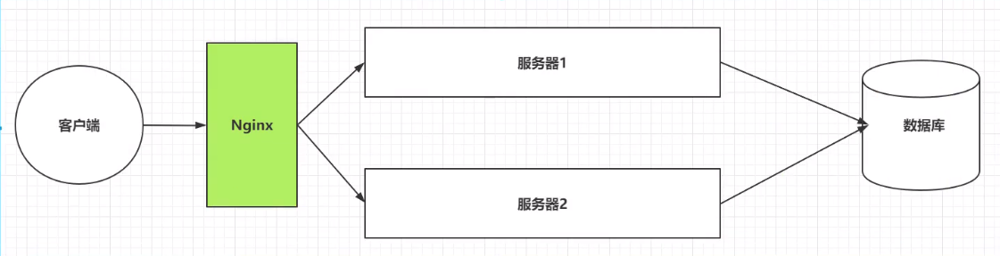

# Nginx

## Nginx介绍

* 为什么要学习Nginx？
  * 客户端到底要将请求发送给哪台服务器
  * 如果所有客户端的请求都发送给了服务器1
  * 客户端发送的请求可能是申请动态资源的 也有申请静态资源的

* 在服务器搭建集群后，用Nginx做反向代理服务器

* Nginx特点
  * 稳定性强，7*24无间断运行
  * 提供丰富配置示例
  * 占用内存小，并发能力强

## Nginx的安装

