# Python语法

## turtle库

1. turtle绘图窗体布局

   设置窗体大小及位置：`turtle.setup(width,height,startx,starty)`

   （若不指定窗体位置，默认窗体在屏幕中央）


2. turtle空间坐标体系

   * 绝对坐标

     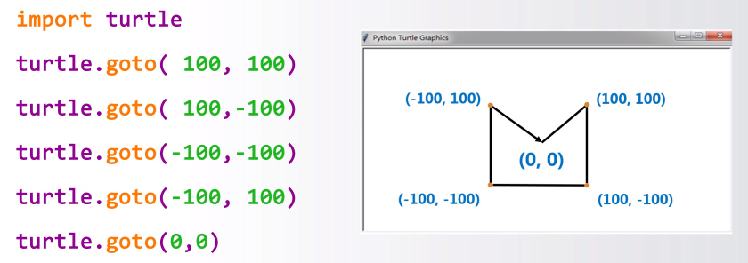

   * 海龟坐标

     向海龟正前方运行：`turtle.fd(d)`

     向海龟反方向运行：`turtle.bk(d)`

     以海归当前位置左侧的某一个点为圆心进行曲线运行：`turtle.circle(r,angle)`

     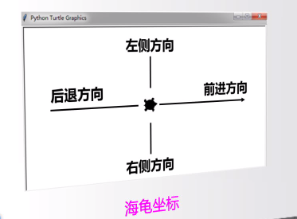

3. turtle角度坐标体系

   * 绝对角度

     改变海龟行进方向：`turtle.seth(angle)`（若不指定angle，默认画整圆）

     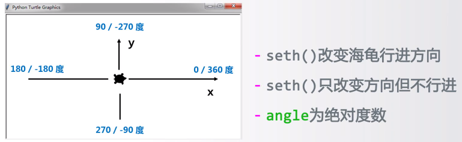

   * 海龟角度

     海龟向左改变运行方向：`turtle.left(angle)`

     海龟向右改变运行方向：`turtle.right(angle)`

4. RGB色彩体系

   turtle库默认使用小数值，可切换为整数值：`turtle.colormode(mode)`

   mode=1.0为小数值模式，mode=255为整数值模式

   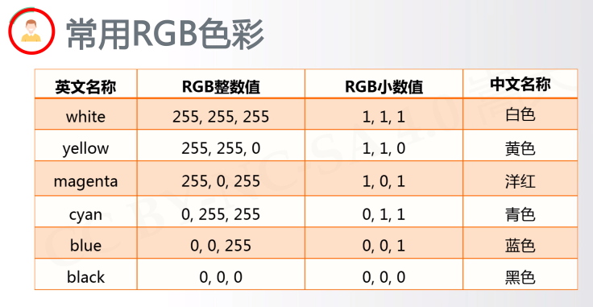

   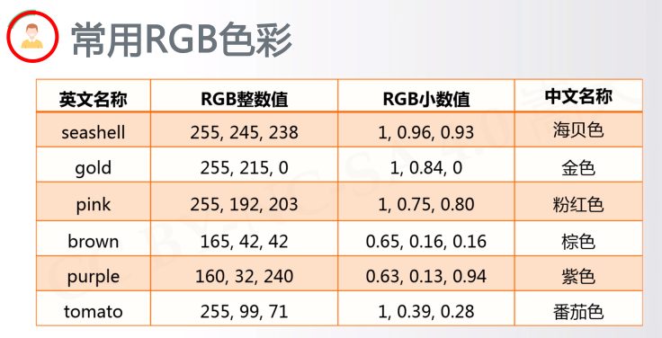

5. 画笔控制

   抬起画笔：`turtle.pu()`

   放下画笔：`turtle.pd()`

   设置画笔宽度：`turtle.width(width)`

   设置画笔颜色：`turtle.pencolor(colorstring||r,g,b||(r,g,b))`

## 基础语法

1. 整数类型：没取值范围限制

   二进制：0b010，-0B101

   八进制：0o123,-0O456

   十进制：1010,-217

   十六进制：0x9a,-0X89

2. 浮点数类型：存在不确定尾数，不是bug，因为二进制表示小数可以无限接近但不完全相同

   支持科学计数法：`4.3e-3`为4.3*10的-3次方

   浮点数间比较一般采用：`round(x,d)`，对x四舍五入，d是小数截取位数

   `round(0.1+0.2,1)==0.3`为true

3. 复数类型：获取实部`z.real`，获取虚部`z.imag`

4. 运算操作符：支持二元操作符`x op = y`

   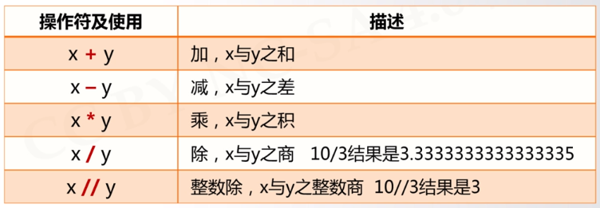

   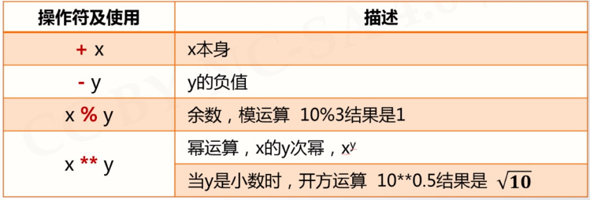

5. 运算函数：

   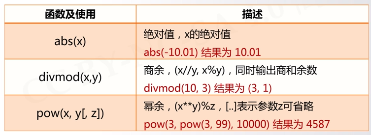

   最大值函数：`max(x1,x2,...,xn)`

   最小值函数：`min(x1,x2,...,xn)`

   四舍五入函数：`round(x[,d])`，d默认为0

   类型转换函数：`int(x)` `float(x)` `complex()`

6. 字符串：

   字符串切片：`"0123"[m:n:k]`，其中m缺失补0，n缺失补字符个数，k为步长，当k为-1指从后向前逐一取出

   字符串连接：`x+y`

   复制n次字符串x：`x*n`

   x是否为s子串：`x in s`

7. 字符串处理函数：

   返回字符串长度：`len(x)`

   类型转换函数：`str(x)`

   将十进制整数转成十六进制形式字符串：`hex(425)`

   将十进制整数转成八进制形式字符串：`oct(425)`

   返回Unicode编码对应的字符：`chr(u)`

   返回字符对应的Unicode编码：`ord(x)`

8. 字符串处理方法：

   返回字符串的副本，全部字符大写：`str.upper()"`

   返回字符串的副本，全部字符小写：`str.lower()"`

   返回一个列表，由sep分割：`str.split(sep=None)`

   返回子串sub出现次数：`str.count("a")`

   old子串替换为new：`str.replace(old,new)`

   字符串居中：`str.center(width[,fillchar])`

   去掉开头和结尾指定字符们：`str.strip(chars)`，lstrip()和rstrip()分别去掉开头与结尾

   iter变量除最后元素外每个元素后增加个str：`str.join(iter)`，主要用于字符串分隔

9. 字符串类型的格式化：

   使用槽机制+format方法：`<模板字符串>.format(<逗号分隔的参数>)`
   
   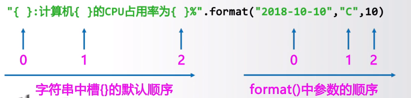
   
10. 槽内部的格式控制：

   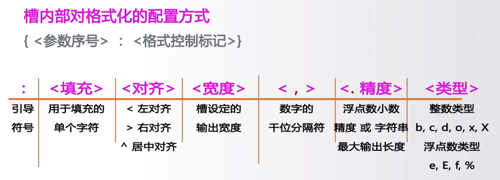

   <center class="half">
       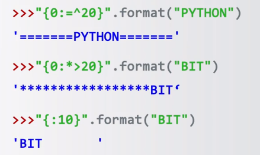
       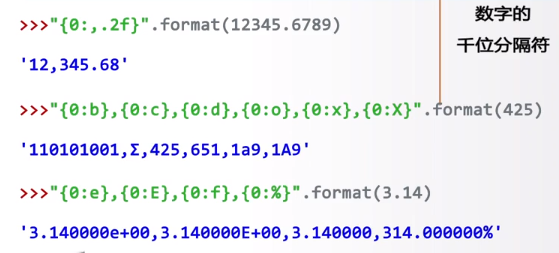
   </center>

## time库

1. 常用函数

   时间获取：`time()` ,`ctime()` ,`gmtime()`

   时间格式化：`strftime(tpl,ts)`，其中tpl是格式化模板字符串，定义输出效果，ts是时间类型变量

   时间反格式化：`strptime(str,tpl)`，其中str是字符串形式时间值，tpl是格式化模板字符串，定义输入效果

   程序计时：`perf_counter()`，返回一个CPU级别精确时间计数值，一般连续调用求差值

   程序休眠：`sleep(s)` ，s可以是浮点数

2. 文本进度条demo

   ```python
   import time
   scale = 50
   print("begin".center(scale//2, '-'))
   start = time.perf_counter()
   for i in range(scale+1):
       a = '*'*i
       b = '.'*(scale-i)
       c = (i/scale)*100
       dur = time.perf_counter()-start
       # 用后打印的字符覆盖之前的字符：其中\r表示光标回到行首，end=''表示不换行
       print("\r{:^3.0f}%[{}->{}]{:.2f}s".format(c, a, b, dur), end='')
       time.sleep(0.1)
   print("\n"+"end".center(scale//2, '-'))
   ```

3. 文本进度条设计函数

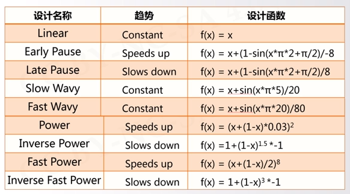

## 程序控制结构

1. 分支结构

   ```python
   # 异常处理机制
   try:
       # eval(str): 返回str(字符串表达式)的计算结果
       score = eval(input())
       if score >= 90:
           grade = 'A'
       elif score >= 80:
           grade = 'B'
       elif score >= 70:
           grade = 'C'
       else:
           grade='D'
       print("成绩等级为{}".format(grade))
   except NameError:							# except语句块：异常时执行
       print("输入的不是整数！")
   except SyntaxError:							# except语句块：异常时执行
       print("没有输入！")
   else:										# else语句块：无异常时执行
       print("程序正常执行。")
   finally:									# finally语句块：一定执行
       print("运行结束。")
   ```

   二分支可以写成紧凑结构（但对应的执行块只可以是表达式不可以是语句）

   ```python
   guess = eval(input())
   print("猜{}了".format("对" if guess == 99 else "错"))
   ```

2. 循环结构

   计数循环：`for i in range(M,N,K) :`（产生M到N-1整数序列，步长为K，产生循环，M缺省 = 0，K缺省 = 1）

   字符串遍历循环：`for c in range s :`（s是字符串，遍历字符串每个字符，产生循环）

   列表遍历循环：`for item in range ls :`（ls是一个列表，遍历其每个元素，产生循环）

   文件遍历循环：`for line in range fi :`（fi是一个文件标识符，遍历其每行，产生循环）

   支持元组，字典遍历循环

   支持while条件循环

   支持break(结束一层循环), continue(结束一层的一次循环), else(正常执行的奖励(未break))

## random库

`random.seed(a=None)`：初始化随机数种子，默认为当前系统时间

`random.random()`：生成一个[0.0,1.0)之间的小数

`random.randint(a,b)`：生成一个[a,b]之间的整数

`random.uniform(a,b)`：生成一个[a,b]之间的小数

`random.randrange(m,n[,k])`：生成一个[m,n)之间以k为步长的整数

`random.getrandbits(k)`：生成一个k比特长的整数

`random.choice(seq)`：从seq序列中选择一个元素

`random.shuffle(seq)`：将seq序列随机重新排列

```python
# 蒙特卡罗方法计算圆周率
import random as rd
DARTS = 1000*1000					# DARTS: 撒点总数
hits = 0.0							# hits: 撒点后，圆内部的点数量
for i in range(1, DARTS+1):
    x, y = rd.random(), rd.random()
    dist = pow(x**2+y**2, 0.5)		# dist: 到坐标原点的距离，小于1则在圆内
    if dist <= 1.0:
        hits += 1
pi = 4*(hits/DARTS)
print("圆周率值为：{}".format(pi))
```

## 函数

使用def定义函数，支持可选参数（即赋初值，要在必选参数的后面）和可变参数（*b），函数可以返回0个或多个结果

有全局变量、局部变量的概念，可见性与C相同，但在函数内修改全局变量与C稍有不同（因为Python无需声明变量就可以直接使用）

```python
a = 10
b = [1, 2, 3]


def modifyA():			# 在函数内部使用外部全局变量（基本数据类型），需使用global声明才可以修改
    global a
    a = a - 1
    print(a)


def modifyA():
    print(a)
    a = a-1				# 错误：在函数内部使用外部全局变量（基本数据类型），不用global声明，默认a为新的局部变量，但并未初始化所以无法执行


def modifyB():
    b[0] = 9			# 在函数内部使用外部全局变量（组合数据类型），可以直接修改
    print(b)


modifyA()
modifyB()
```

支持lambda定义匿名函数：`f = lambda x,y :x+y`（冒号前面为函数参数，冒号后面为函数的返回值，只能是表达式）

```python
# 七段数码管绘制当前日期
import turtle
import time


def drawGap():  # 绘制数码管间隔
    turtle.penup()
    turtle.fd(5)


def drawLine(draw):  # 绘制单段数码管
    drawGap()
    turtle.pendown() if draw else turtle.penup()
    turtle.fd(40)
    drawGap()
    turtle.right(90)


def drawDigit(digit):  # 根据数字绘制七段数码管
    drawLine(True) if digit in [2, 3, 4, 5, 6, 8, 9] else drawLine(False)
    drawLine(True) if digit in [0, 1, 3, 4, 5, 6, 7, 8, 9] else drawLine(False)
    drawLine(True) if digit in [0, 2, 3, 5, 6, 8, 9] else drawLine(False)
    drawLine(True) if digit in [0, 2, 6, 8] else drawLine(False)
    turtle.left(90)
    drawLine(True) if digit in [0, 4, 5, 6, 8, 9] else drawLine(False)
    drawLine(True) if digit in [0, 2, 3, 5, 6, 7, 8, 9] else drawLine(False)
    drawLine(True) if digit in [0, 1, 2, 3, 4, 7, 8, 9] else drawLine(False)
    turtle.left(180)
    turtle.penup()
    turtle.fd(20)


def drawDate(date):  # 根据日期绘制数码管，日期格式为'%Y-%m=%d+'
    turtle.pencolor("red")
    for i in date:
        if i == '-':
            turtle.write('年', font=("Arial", 18, "normal"))
            turtle.pencolor("green")
            turtle.fd(40)
        elif i == '=':
            turtle.write('月', font=("Arial", 18, "normal"))
            turtle.pencolor("blue")
            turtle.fd(40)
        elif i == '+':
            turtle.write('日', font=("Arial", 18, "normal"))
        else:
            drawDigit(eval(i))


turtle.setup(800, 350, 200, 200)
turtle.penup()
turtle.fd(-300)
turtle.pensize(5)
drawDate(time.strftime("%Y-%m=%d+", time.gmtime()))
turtle.hideturtle()
turtle.done()
```